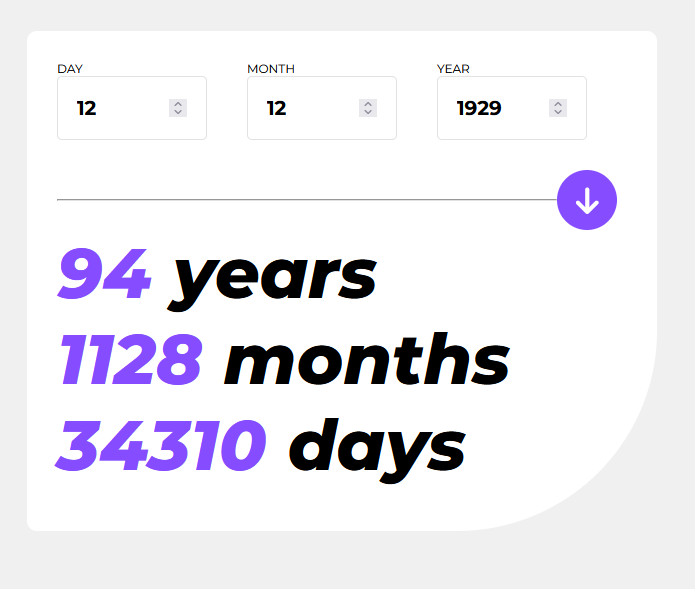
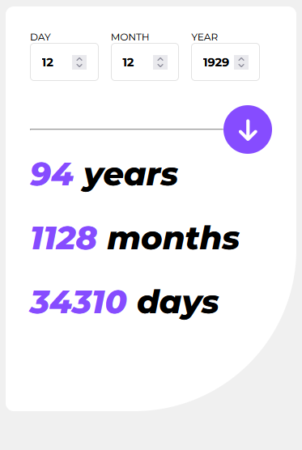
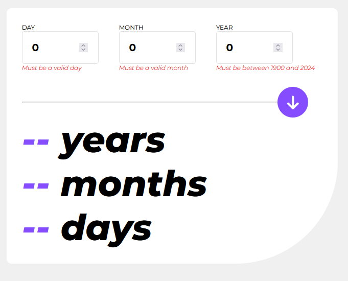

# Frontend Mentor - Age calculator app solution

This is a solution to the [Frontend Mentor - Age calculator app](https://www.frontendmentor.io/challenges/age-calculator-app-dF9DFFpj-Q). Frontend Mentor challenges help you improve your coding skills by building realistic projects.

## Table of contents

- [Overview](#overview)
  - [The challenge](#the-challenge)
  - [Screenshot](#screenshot)
  - [Links](#links)
- [My process](#my-process)
  - [Built with](#built-with)
  - [What I learned](#what-i-learned)
  - [Continued development](#continued-development)
  - [Useful resources](#useful-resources)
- [Author](#author)

## Overview

### The challenge

Users should be able to:

    -Enter their birth date and receive their age in years, months, and days.
    -Experience smooth and appealing animations when interacting with the application.
    -Enjoy a responsive and accessible interface, compatible with various devices.

### Screenshot

### Links

- Solution URL: [Netlify](https://age-calculator-app-andrea.netlify.app/)

## My process

### Built with

    -TypeScript: This project was an excellent opportunity to dive into TypeScript, enhancing code quality and reliability.

    -React with React-Spring: The app is built with React, utilizing the react-spring library for adding lively animations.

    -Responsive Design: The application is designed to be fully responsive, providing a consistent experience across different screen sizes.

    -CSS: Custom CSS styles for a visually appealing and user-friendly interface.

### What I learned

This project was a significant milestone in my development journey, marking my first foray into TypeScript and advanced animations with react-spring. Here are some key learnings:

    -TypeScript Integration: Initially, TypeScript posed a challenge, but it soon proved its worth in ensuring type safety and reducing runtime errors.

    -React-Spring: Using react-spring for the first time was exciting. It allowed me to create more dynamic, smooth, and engaging animations that enhanced the overall user experience.

    -Component Design: Balancing functionality and aesthetics within React components was crucial. I focused on creating a seamless flow between user input and animation feedback.

### Continued development

In future projects, I aim to further explore TypeScript's capabilities and delve deeper into animation libraries like react-spring. I'm also interested in improving my skills in state management and exploring more complex animations and interactions.

### Useful resources

- [Scrimba typescript course](https://scrimba.com/learn/typescript) - I gained valuable insights from the typescript course on Scrimba.
- [Youtube: How To Create Animated Numbers In React.js ](https://www.youtube.com/watch?v=SsDtEq50xiQ) - I learned how to use react animation library react-spring.

## Author

- GitHub - [Andrea Axelsson](https://github.com/Andrea-Axelsson)
- LinkedIn - [Andrea Axelsson](https://www.linkedin.com/in/axelsson-andrea/)
